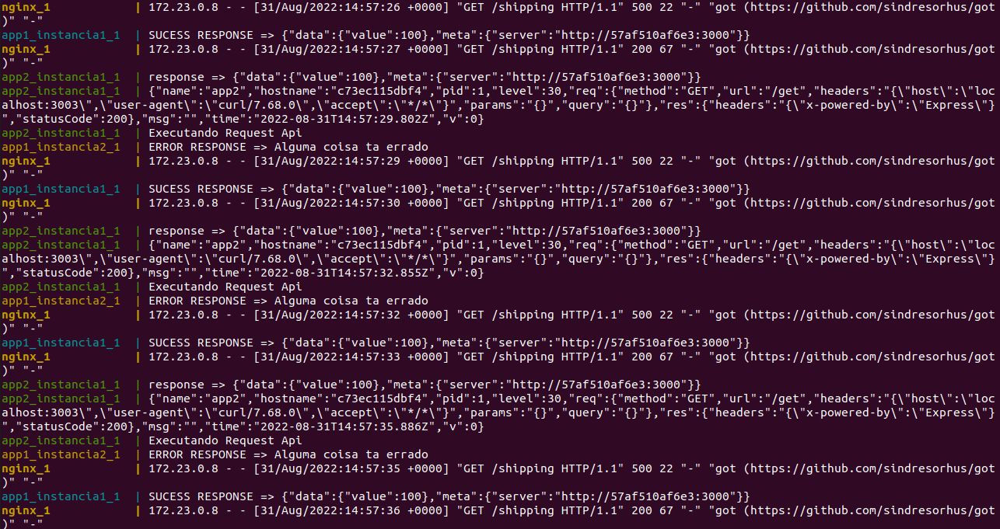

<h1 align="center">
 
  
 
 
</h1>
 

Project studies on scaling software maintaining its performance

## Overview

This was a project created in the classroom, the purpose of this project was to understand how we can scale applications and acquire performance on them, together with the project we used some tools to facilitate and make our entire process useful.

## Screenshots

<h4>New Relic</h4>

<h4>Aplicação</h4>

<h4>Requests</h4>

## Building

You'll need [docker](https://www.docker.com/) installed on your computer for do build this project.
